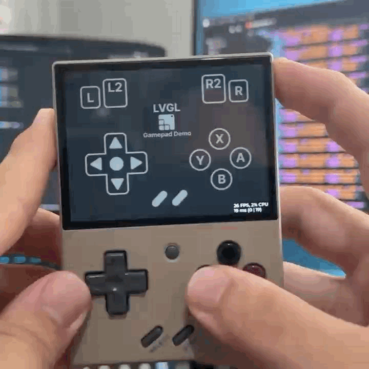
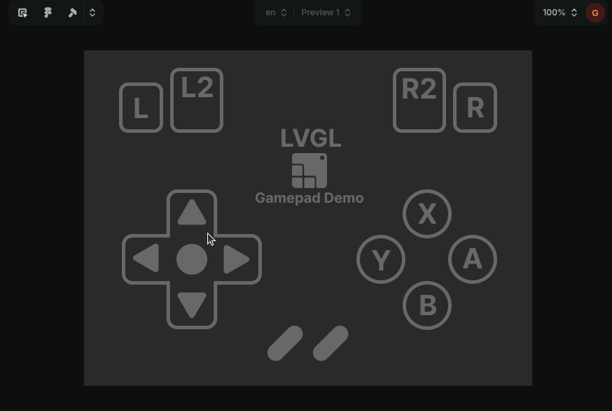

# Miyoo Mini Plus LVGL Gamepad Example

This example runs an LVGL UI using SDL backend on the Miyoo Mini Plus handheld game console and also reads button events using SDL keyboard handling.

For this to work you should use SDL2 library from here: [https://github.com/steward-fu/sdl2](https://github.com/steward-fu/sdl2)

For building run `./build_miyoo.sh`

Inside `sd_card_deploy` you can find a folder that you can just drop inside `SDCARD/App` and the application will appear under OnionOS Apps menu.

You can preview the UI online with LVGL Pro Online Preview here: [https://viewer.lvgl.io/?repo=https://github.com/giobauermeister/miyoo_mini_plus_lvgl_gamepad_demo/tree/master/gamepad_ui](https://viewer.lvgl.io/?repo=https://github.com/giobauermeister/miyoo_mini_plus_lvgl_gamepad_demo/tree/master/gamepad_ui)